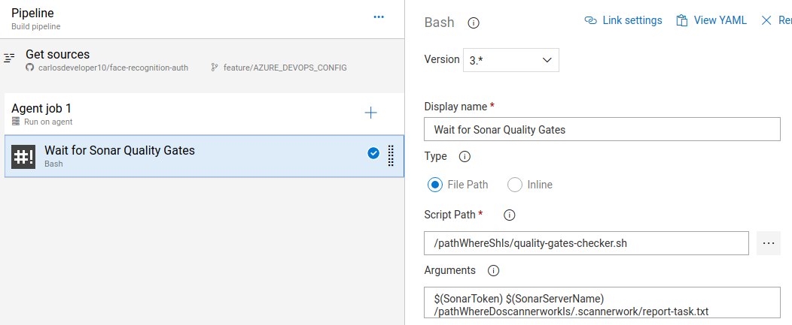
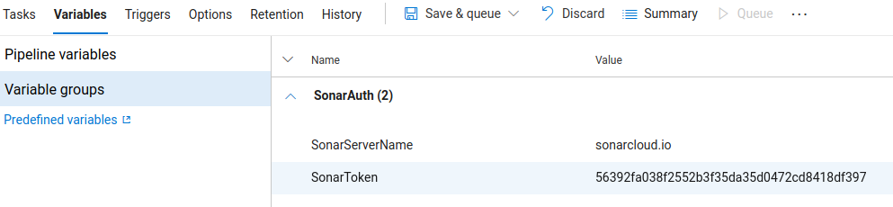
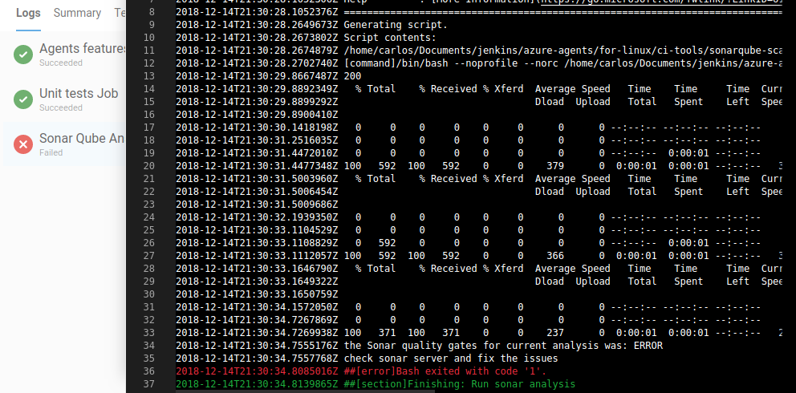
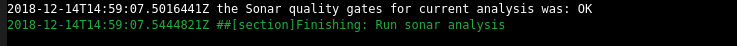
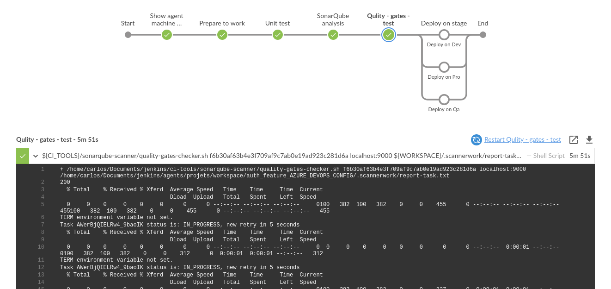

# wait-for-sonar-qg
This bash script waits for the sonar's quality gates and breaks the build when any quality gate fails.

## Why was it created?
This bash script was created to be used in Azure DevOps because there is no way to break builds when quality gates fail unless it's with gradle or maven plugin. So, this bash script supplies it, you can break any build when quality gates fail because it is agnostic to any lenguage or build tool.

## In what platform was it tested?
### Azure DevOps 
#### Configuration
* YAML

```YAML
  # Before execute the sonar analysis in previous steps
  steps:
  - script: /pathWhereShIs/quality-gates-checker.sh $(SonarToken) $(SonarServerName) /pathWhereDoscannerworkIs/.scannerwork/report-task.txt 
  displayName: Wait for sonar analysis
 ```
 
 * GUI designer
 
 
 
 variables
 
 
### Jenkins
It was tested in jenkins to check the rigth operation in a CI server different to Azure Devops.

#### Configuration
* Jenkinsfile

```groovy
# Before execute the sonar analysis in previous stages
stage('Qulity - gates - test') {
  steps {
    sh '/pathWhereShIs/quality-gates-checker.sh ${SonarToken} ${SonarServerName} /pathrWhereDoscannerworkIs/.scannerwork/report-task.txt'
    }
}
 ```

#### Understanding the variables passed to the bash script
The bash script needs 3 parameters to be executed correctly:
 ```shell
./quality-gates-checker.sh $(SonarToken) $(SonarServerName) $(reportTask)
 ```
* $(SonarToken)
Sonar token to auth in sonar server API

* $(SonarServerName)
Sonar server name used for the analysis

* $(reportTask)
File create by sonar-scanner at moment of analysis; normally is __.scannerwork/report-task.txt__ and its location is in the project root

**Execution example:**
 ```shell
./quality-gates-checker.sh my_token_here sonarcloud.io /home/carlosdeveloper10/aws_face_auth/.scannerwork/report-task.txt
 ```
 
 
## Result examples
* **_When quality gates fail on Azure DevOps_**

 
 
 
* **_When quality gates pass on Azure DevOps_**

 
 
 
* **_jenkins_**


